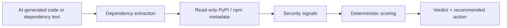

# SlopGuard

**AI can invent packages. Attackers can register them. Check before you install.**

SlopGuard is a pre-install dependency check for AI-generated code. Paste what an AI assistant wrote (imports, `requirements.txt`, `package.json`, or an install command) and SlopGuard checks every package against public PyPI and npm data *before* you run `pip install` or `npm install`. Nothing is installed and no submitted code is executed.

Built for the **TLN Cybersecurity Challenge 2026**.

| | |
|---|---|
| Live demo | https://slop-guard.vercel.app |
| API health | https://slopguard-api.vercel.app/api/health |
| Demo video | [`TODO: paste video link`](https://youtu.be/AfIToHRgUqk) |
| Repository | https://github.com/alizahh-7/SlopGuard- |

## Contents

1. [The problem](#1-the-problem)
2. [What SlopGuard does](#2-what-slopguard-does)
3. [Features](#3-features)
4. [Results we observed](#4-results-we-observed)
5. [Evaluation and benchmark](#5-evaluation-and-benchmark-read-this-before-quoting-any-number)
6. [Security and privacy design](#6-security-and-privacy-design)
7. [Known limitations](#7-known-limitations)
8. [Project structure](#8-project-structure)
9. [Run it locally](#9-run-it-locally)
10. [Deploy](#10-deploy)
11. [AI and tool disclosure](#11-ai-and-tool-disclosure)
12. [What's next](#12-whats-next)
13. [License](#13-license)

---

## 1. The problem

AI coding assistants sometimes recommend packages that do not exist. That is harmless until someone registers the invented name and puts malware behind it. The next developer who copies the AI's `pip install` line installs the attacker's code. This is often called *slopsquatting*.

Published research shows the risk is real and measurable:

- A USENIX Security 2025 study of 16 models ("We Have a Package for You!") found that 5.2% of packages suggested by commercial models and 21.7% suggested by open-source models did not exist.
- In that study, 43% of the invented names came back on every repeated run, which is what makes them worth registering.
- In a published experiment, a researcher registered an empty package under a name AI assistants kept recommending, and it received more than 30,000 downloads in about three months.

We are **not** claiming widespread attacks. We are showing that the path from "AI invents a name" to "a developer installs it" is real, and that a cheap check before install closes it.

### Who it helps

- **Students and self-taught developers** who paste an AI answer and run it without knowing which names are real.
- **Small teams without a security engineer**, who can put the GitHub Action on every pull request.

The interface is written for beginners: plain-language explanations, a "Learn" walkthrough, and a clear next action for every finding.

---

## 2. What SlopGuard does



1. **Extract** package references from imports, dependency files, install commands, or free text. Import names are mapped to real package names (for example `cv2` to `opencv-python`, `yaml` to `pyyaml`, `serial` to `pyserial`) and the standard library is ignored.
2. **Verify** each package with read-only lookups against PyPI and npm, plus public advisories (OSV). Results are cached.
3. **Score** with fixed, documented rules. The same input gives the same score every time. There is no black-box model in the decision.
4. **Explain** the result: what was found, what it means, and what to do next.

### Verdicts

SlopGuard never says "safe". It reports what the available checks found.

| Verdict | Meaning |
|---|---|
| **OK** | The available checks did not find a significant risk signal. |
| **REVIEW** | At least one signal deserves a closer identity check. |
| **RISKY** | Multiple signals make this dependency questionable. |
| **BLOCK** | Strong risk signals were detected. |
| **UNKNOWN** | Not enough information (for example the registry could not be reached). This is never reported as a risk. |

### Signals

| Signal | What it looks at |
|---|---|
| Phantom package | The declared name is not registered in its registry. |
| Malicious advisory | A public advisory identifies the package as malicious. |
| Historical advisory | A past version was reported; the current version is not affected. Shown as information, not a risk. |
| Typosquat / lookalike | The name is a near-miss of a popular package. A suggested correct name is shown. |
| Very new package | First release is recent. |
| Low downloads | Recent usage is low for the ecosystem. |
| No repository link | Published metadata has no source repository. |
| Single release | Only one version has ever been published. |
| Install-time scripts | An npm package runs code during installation. |
| Lookup failed | Registry data could not be verified. Produces UNKNOWN. |

**Import vs. declared names.** A name that appears in a `requirements.txt` or install command and does not exist is a **BLOCK**. A name inferred from a Python *import* that is not found is **RISKY** instead, because the import name can legitimately differ from the package name.

---

## 3. Features

- **Web scanner.** Paste, pick a format (or auto-detect), get per-package verdicts, risk and trust scores, evidence, and technical details. JSON report download and print view.
- **Safe install.** A copy-paste install command containing only packages with no red flags. Held-back packages are listed with the reason.
- **Fix it for me.** Produces a corrected version of your input as a diff: invented packages are removed (with a comment), and your version pins are preserved. Nothing is installed.
- **Simple explanations.** A toggle that rewrites findings in beginner language.
- **Learn tab.** A short walkthrough of the attack and how to spot it, with a "Try it" button that loads a demo into the scanner.
- **CLI.** `slopguard scan requirements.txt --fail-on risky` returns an exit status suitable for scripts.
- **GitHub Action.** Fails a pull request when a dependency reaches the chosen verdict.
- **MCP server.** Exposes the scanner to MCP-compatible AI assistants so a package can be checked when it is suggested. See `mcp.json` and `mcp_smoke.py`.
- **REST API** with request limits, rate limiting, and timeouts (see below).

---

## 4. Results we observed

These are real runs against the live scanner.

| Input | Result |
|---|---|
| `flask==3.0.3`, `requests`, `slopguard-demo-phantom-pkg-93817` | Phantom package **BLOCK** (risk 100/100). Fix it for me removes only that line and keeps `flask==3.0.3`. |
| `pip install reqeusts` | **BLOCK**: not registered, and a typosquat of `requests` (suggests `requests`). |
| `npm install lodahs` | **BLOCK**: public advisory identifies it as malicious; also a lookalike of `lodash`. |
| `import cv2, yaml, PIL, sklearn, bs4, requests` plus `os`, `json` | All real packages resolved to their correct install names (`opencv-python`, `pyyaml`, `pillow`, `scikit-learn`, `beautifulsoup4`). `os` and `json` ignored. No false alarms. |
| `import dateutil, attr, jwt, dotenv, serial` | Mapped to `python-dateutil`, `attrs`, `pyjwt`, `python-dotenv`, `pyserial`. |
| `axios`, `chalk`, `react`, `express`, `lodash` (`package.json`) | **OK**. Axios and chalk show an informational "historical advisory" note. |
| `hello world this is not a dependency list` | "No package references found" (nothing invented). |

---

## 5. Evaluation and benchmark (read this before quoting any number)

We keep two different artifacts separate on purpose.

### Scorer evaluation: 70 author-labelled cases

`eval/labeled.json` holds 70 cases in four groups: `risky-lookalike`, `risky-phantom`, `safe-niche`, `safe-popular`. `eval/evaluate.py` runs the scorer over them and writes `eval/report.md` and `eval/results.json`.

- After the latest rerun the report shows **no false positives and no false negatives** on these 70 cases.
- An earlier run flagged `axios` and `chalk` because of old advisories on past versions. We changed the scorer so a historical advisory on a fixed version no longer causes a block.
- **Important caveat:** we fixed those two cases specifically, and we wrote the labels ourselves. A perfect score on a small set we tuned against is **not** a real-world accuracy claim. It shows the rules behave as designed on known cases.

### AI benchmark: do models invent packages?

`bench/` sends 40 dependency-only prompts (20 Python, 20 JavaScript, no package names supplied) to several models, extracts the names, and checks them against the registries. The run was configured for 360 calls (3 models x 40 prompts x 3 runs).

- Only **12 of 360** calls completed successfully (all from Gemini: 12 of 120, 0 phantom references). Both Groq models had 0 successful calls.
- **We do not present this as evidence of how often AI invents packages.** Zero observed phantoms with this little data means nothing. The benchmark page states this openly.
- For the rate at which models invent packages, we rely on the published research cited in section 1.

---

## 6. Security and privacy design

- **Read-only.** Only public registry metadata is fetched. Packages are never downloaded, installed, or executed. Submitted code is never run.
- **Content not retained.** Request content is not logged or stored by the service.
- **Request hardening.** 200 KB body limit, input validation (422), rate limiting (429), per-request timeout (504), and at most 60 references analysed per scan.
- **Explicit CORS allow-list** via `ALLOWED_ORIGINS`, and `TRUST_PROXY` for correct client IPs behind a proxy.
- **Honest uncertainty.** A failed registry lookup becomes UNKNOWN, never a phantom claim.
- **Testing.** 125 automated tests pass (API, extraction, registry, cache, signals, scoring, CLI, benchmark, evaluation, models).

---

## 7. Known limitations

- Covers **PyPI and npm only**.
- It does **not** read a package's source code and is not a malware scanner. It reports metadata signals.
- The strongest case is a name that does not exist. A malicious package that was *already registered* is caught only through weaker signals (age, downloads, missing repository, single release, advisories, lookalike name). We have not measured how well that works against real slopsquatting attacks.
- Import-name to package-name mapping uses a curated table. Rare aliases not in the table are reported as RISKY for review rather than resolved.
- **Safe install lists package names, not version pins.** Use *Fix it for me* to keep your pins.
- The 70-case evaluation is small, author-labelled, and was tuned against (see section 5).
- The AI benchmark has too little data to support conclusions.

---

## 8. Project structure

```text
SlopGuard-
├── api/               FastAPI backend (scan, fix, samples, benchmark, health)
├── core/              Extraction, registry lookups, signals, scoring
├── cli/               Command-line interface
├── mcp_server/        MCP server that exposes the scanner to AI assistants
├── web/               React 19 + Vite + Tailwind CSS v4 frontend
├── bench/             AI-generated package benchmark
├── eval/              Labelled evaluation (labeled.json, evaluate.py, report.md)
├── tests/             Automated tests
├── data/              Registry popularity data
├── demo/              Demo material
├── scripts/           Helper scripts
├── .github/workflows/ CI workflows
├── action.yml         GitHub Action
├── pyproject.toml     Python package metadata
├── requirements.txt   Backend dependencies
├── .env.example       Example environment variables
├── AGENTS.md, .cursor/  Cursor AI configuration (see disclosure)
└── LICENSE            MIT
```

### API

| Endpoint | Purpose |
|---|---|
| `POST /api/scan` | Scan pasted content (`content`, `kind`) |
| `POST /api/fix` | Return a corrected version of the input as a diff |
| `GET /api/samples` | Demo inputs |
| `GET /api/benchmark` | Published benchmark aggregate |
| `GET /api/health` | Health check |

---

## 9. Run it locally

**Clone:**

```powershell
git clone https://github.com/alizahh-7/SlopGuard-.git
cd SlopGuard-
```

See `.env.example` for the environment variables the backend understands.

**Backend** (Python 3.10+):

```powershell
python -m venv .venv
.\.venv\Scripts\Activate.ps1
pip install -r requirements.txt
$env:ALLOWED_ORIGINS = "http://localhost:5173,http://127.0.0.1:5173"
python -m uvicorn api.main:app --reload --port 8000
```

**Frontend:**

```powershell
cd web
Set-Content .env.local "VITE_API_BASE_URL=http://127.0.0.1:8000"
npm install
npm run dev
```

Open the URL Vite prints (normally `http://localhost:5173`).

**Tests and evaluation:**

```powershell
python -m pytest -q
python eval/evaluate.py
```

**CLI:**

```powershell
slopguard scan requirements.txt --fail-on risky
```

**GitHub Action:**

```yaml
- uses: alizahh-7/SlopGuard-@main
  with:
    fail-on: risky
```

**MCP server:** see `mcp.json` (points at a separate `.venv-mcp`; the `mcp` package is deliberately not in `requirements.txt`, so the hosted API stays small) and run `mcp_smoke.py` for a quick check.

---

## 10. Deploy

- **Backend (Vercel):** deployed at `https://slopguard-api.vercel.app`. Environment: `ALLOWED_ORIGINS=https://slop-guard.vercel.app` and `TRUST_PROXY=1`.
- **Frontend (Vercel):** root directory `web`, environment `VITE_API_BASE_URL=https://slopguard-api.vercel.app`.

---

## 11. AI and tool disclosure

- **AI assistants used during development:** Claude (Anthropic) and Cursor were used for coding help, debugging, copywriting, and reviewing this README. All code was run and tested by the team.
- **Models called by the benchmark:** Gemini and Groq-hosted models, via their APIs.
- **Committed AI tooling files:** `AGENTS.md` and the `.cursor/` folder are Cursor configuration files. They are in the repository so the AI-assisted workflow is visible.
- **Third-party components:** FastAPI, React, Vite, Tailwind CSS, and the animated-gradient background component from 21st.dev (Componentry).
- **Data sources:** PyPI, npm registry, and OSV advisories (public, read-only).
- **Development timeline:** `TODO: state honestly when the project was started and which parts, if any, existed before the event began.`

---

## 12. What's next

- More ecosystems (Go, Rust) and lockfile diffing.
- A browser extension that checks package names inside AI chat code blocks.
- Pinned versions in Safe install.
- A larger, independently labelled evaluation set and a benchmark with complete model coverage.

---

## 13. License

MIT. See [LICENSE](LICENSE).
